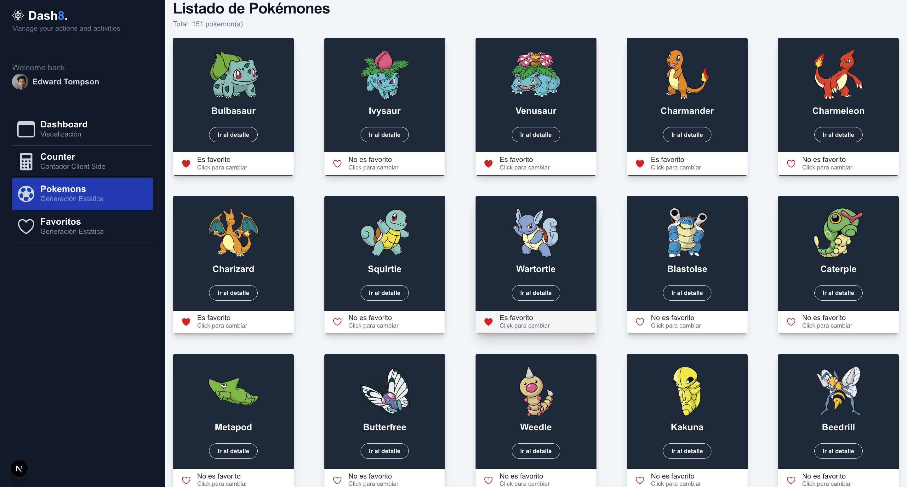

# 🧩 PokeDash — Dashboard de Pokemones

Un **dashboard interactivo** construido con **Next.js**, **Tailwind CSS** y la **PokéAPI**, que permite visualizar estadísticas, totales y favoritos de Pokemones de manera moderna y dinámica.

---

## 🚀 Características principales

- 📊 **Dashboard informativo** con tarjetas (Pokemones atrapados, totales y favoritos).  
- 💾 **Manejo de estado global con Redux Toolkit** (contador, favoritos, etc.).  
- ⚡ **Consumo de PokéAPI** desde el servidor (Server Components).  
- 📈 **Gráficos estadísticos** para representar datos de forma visual.  
- 🌈 **Interfaz moderna y responsiva** con Tailwind CSS.  
- 🌀 **Animaciones suaves** con Framer Motion. 

---

## 🛠️ Tecnologías utilizadas


## 🖼️ Vista previa
 
> Ejemplo:  
> 

---

## ⚙️ Instalación y uso

1. **Clonar repositorio**
```bash
git clone https://github.com/Janetquispeu/poke-dash-next.git
```

2. **Instalar dependencias** 
```bash
npm install
```

3. **Crear file .env en la raiz del proyecto y agregar valor** 
```bash
NEXT_PUBLIC_API_URL="https://pokeapi.co/api/v2"
```

3. **Ejecutar comando** 
```bash
npm run dev
```

Abrir en [http://localhost:3000](http://localhost:3000).

## Despliegue en vercel
[https://poke-dash-li7uj30cg-janets-projects-92e39707.vercel.app/dashboard/favorites](https://poke-dash-li7uj30cg-janets-projects-92e39707.vercel.app/dashboard/favorites)

